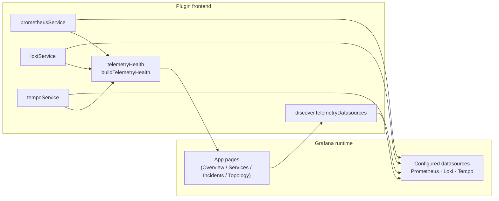
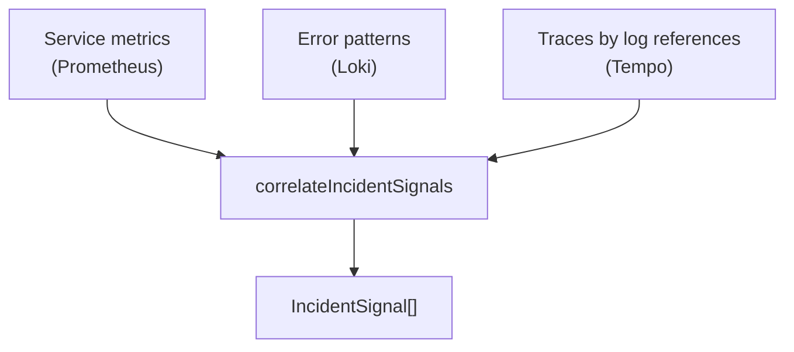
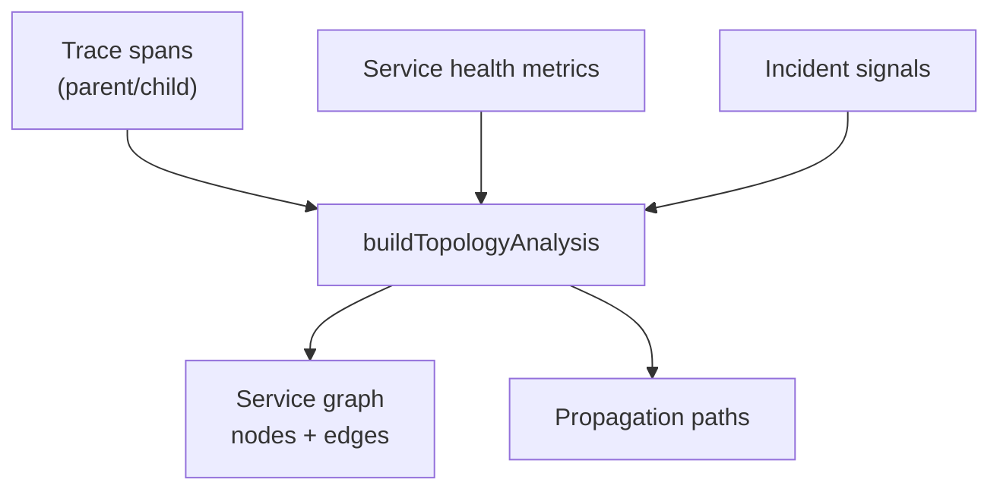
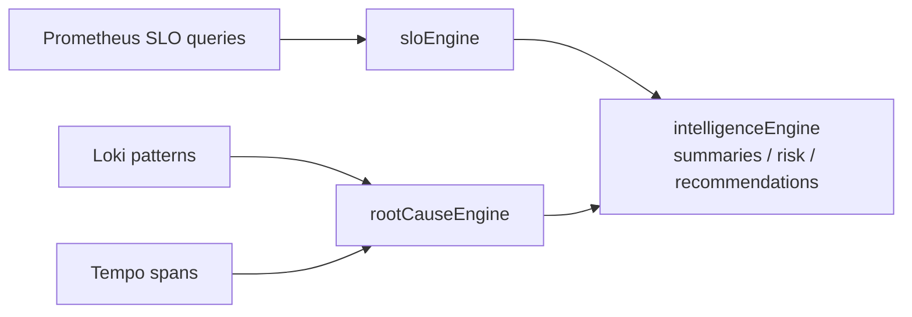
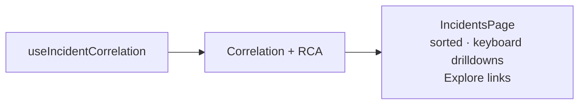

# Reliability Control Plane — architecture

This Grafana **app plugin** follows the official app plugin model: `AppPlugin` in `src/module.tsx`, lazy-loaded routes in `src/components/App/App.tsx`, and datasource-driven pages using `PluginPage` from `@grafana/runtime` and `@grafana/ui` primitives.

References: [Build an app plugin](https://grafana.com/developers/plugin-tools/tutorials/build-an-app-plugin), [App plugin how-to guides](https://grafana.com/developers/plugin-tools/how-to-guides/app-plugins/), [Anatomy of a plugin](https://grafana.com/developers/plugin-tools/key-concepts/anatomy-of-a-plugin).

## Telemetry ingestion and datasource flow

## Correlation engine

## Topology inference and propagation

## SLO engine and operational intelligence

## Operational intelligence pipeline (incident page)

All analysis stays **in-browser** over Grafana’s datasource APIs; the plugin does not duplicate telemetry storage.
