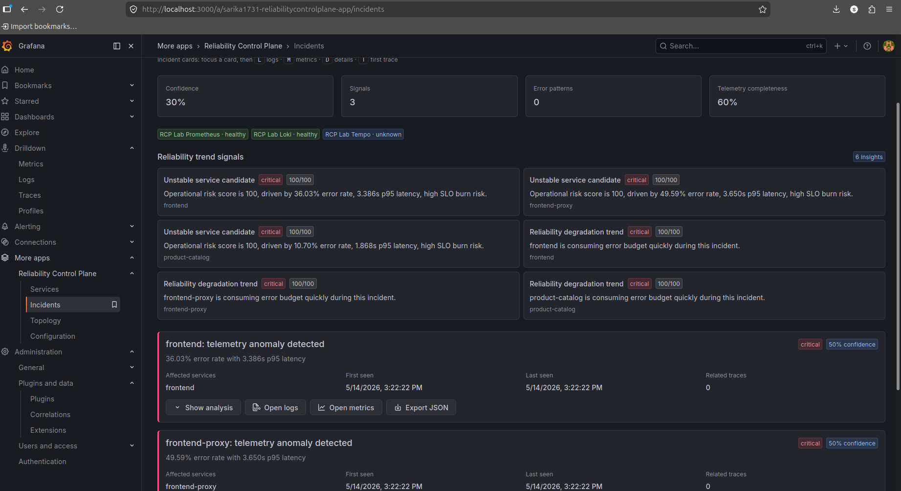
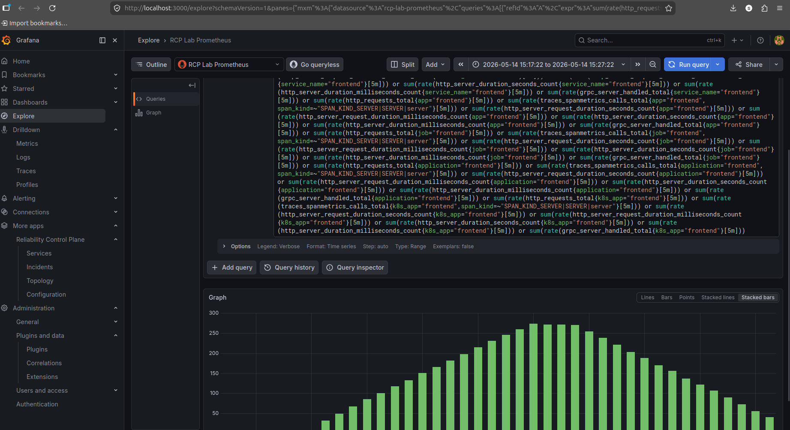
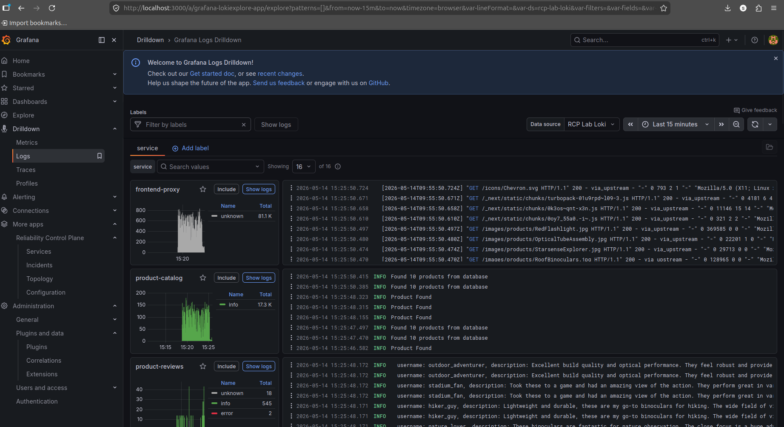

# Reliability Control Plane

[](https://grafana.com)
[](https://opensource.org/licenses/Apache-2.0)

A comprehensive Grafana app plugin for monitoring and managing system reliability, incidents, and service health in real-time.

## Overview

The Reliability Control Plane plugin provides a unified dashboard for observing and controlling the reliability of your systems. It integrates with various data sources to offer insights into:

- **Incident Management**: Track and correlate incidents across your infrastructure
- **Service Health Monitoring**: Real-time status of all services and components
- **Topology Analysis**: Visualize service dependencies and relationships
- **Operational Intelligence**: AI-powered root cause analysis and recommendations

### Key Features

- 📊 **Real-time Dashboards**: Live monitoring of system health and performance
- 🚨 **Incident Correlation**: Automatic detection and correlation of related incidents
- 🏗️ **Service Topology**: Interactive visualization of service dependencies
- 🤖 **Intelligent Insights**: Machine learning-powered root cause analysis
- 📈 **Trend Analysis**: Historical trends and predictive analytics
- 🔧 **Operational Controls**: Direct actions for incident response

## Screenshots

### Overview Dashboard


### Incidents Page


### Topology View


## Requirements

- **Grafana**: Version 11.0 or later
- **Data Sources**:
  - Prometheus (for metrics)
  - Loki (for logs)
  - Tempo (for traces)
  - PostgreSQL/MySQL (for incident data)
- **Node.js**: Version 22+ (for development)

## Getting Started

### Installation

1. **From Grafana Marketplace** (Recommended):
   - Go to Grafana > Administration > Plugins
   - Search for "Reliability Control Plane"
   - Click Install

2. **Manual Installation**:
   ```bash
   # Download the plugin ZIP from releases
   # Extract to Grafana plugins directory
   # Restart Grafana
   ```

### Configuration

1. **Data Source Setup**:
   - Configure Prometheus, Loki, and Tempo data sources
   - Set up database connection for incident tracking

2. **Plugin Configuration**:
   - Access the plugin from Grafana sidebar
   - Configure alerting thresholds and notification channels
   - Set up service topology mappings

3. **Permissions**:
   - Ensure users have appropriate permissions for incident management

### Basic Usage

1. **Navigate to the Plugin**: Click "Reliability Control Plane" in the Grafana sidebar
2. **Overview Page**: Get a high-level view of system health
3. **Incidents Page**: View and manage active incidents
4. **Services Page**: Monitor individual service status
5. **Topology Page**: Explore service relationships

## Documentation

For detailed documentation, API references, and advanced configuration:

- [Plugin Documentation](https://github.com/sarika-03/reliability-control-plane/docs/)
- [Grafana Plugin Development](https://grafana.com/developers/plugin-tools/)
- [API Reference](https://github.com/sarika-03/reliability-control-plane/api/)

## Contributing

We welcome contributions! Please see our [Contributing Guide](https://github.com/sarika-03/reliability-control-plane/blob/main/CONTRIBUTING.md) for details.

### Development Setup

```bash
# Clone the repository
git clone https://github.com/sarika-03/reliability-control-plane.git
cd reliability-control-plane

# Install dependencies
npm install

# Start development server
npm run dev

# Build for production
npm run build
```

### Reporting Issues

- [GitHub Issues](https://github.com/sarika-03/reliability-control-plane/issues)
- [Grafana Community Forums](https://community.grafana.com/)

## License

This plugin is licensed under the Apache License 2.0. See [LICENSE](https://github.com/sarika-03/reliability-control-plane/blob/main/LICENSE) for details.

## Support

- 📧 **Email**: sarikasharma9711@gmail.com
- 💬 **Community**: [Grafana Community](https://community.grafana.com/)
- 🐛 **Bug Reports**: [GitHub Issues](https://github.com/sarika-03/reliability-control-plane/issues)

---

Made with ❤️ by [sarika-03](https://github.com/sarika-03)
